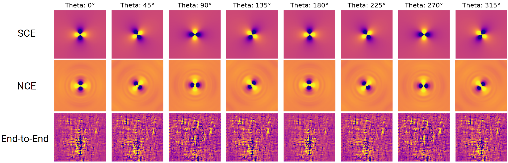

# Neural Contrast Expansion

Effective properties of composite materials are defined as the ensemble average of property-specific PDE solutions over the underlying microstructure distributions. Traditionally, predicting such properties can be done by solving PDEs derived from microstructure samples or building data-driven models that directly map microstructure samples to properties. The former has a higher running cost, but provides explainable sensitivity information that may guide material design; the latter could be more cost-effective if the data overhead is amortized, but its learned sensitivities are often less explainable. With a focus on properties governed by linear self-adjoint PDEs (e.g., Laplace, Helmholtz, and Maxwell curl-curl) defined on bi-phase microstructures, we propose a structure-property model that is both cost-effective and explainable. Our method is built on top of the strong contrast expansion (SCE) formalism, which analytically maps N-point correlations of an unbounded random field to its effective properties. Since real-world material samples have finite sizes and analytical PDE kernels are not always available, we propose Neural Contrast Expansion (NCE), an SCE-inspired architecture to learn surrogate PDE kernels from structure-property data. For static conduction and electromagnetic wave propagation cases, we show that NCE models reveal accurate and insightful sensitivity information useful for material design. 
Compared with other PDE kernel learning methods, our method does not require measurements about the PDE solution fields, but rather only requires macroscopic property measurements that are more accessible in material development contexts.

---

## Overview

Classical strong contrast expansions provide a differentiable map from microstructural statistics to effective properties, but low-order truncations can become inaccurate in challenging regimes. This project explores a neural correction of that analytical structure rather than replacing it with a purely black-box surrogate.

At a high level, the workflow is:

1. Generate or load microstructures
2. Compute correlation descriptors such as 2PCF / 3PCF
3. Build the SCE effective-property pipeline
4. Replace or augment the analytical kernel with a learnable neural model
5. Train with data loss plus physics-informed regularization
6. Evaluate both effective-property prediction and descriptor-space sensitivities (e.g., \(\partial \Sigma_{\mathrm{eff}} / \partial S_2\))
7. Use the resulting sensitivities to guide inverse design

---
## Demo: Learned Kernel Structure Across Directions

The figure below compares the kernel structure produced by three approaches across different directions $\theta$:

- **SCE**: analytical kernel from the truncated strong-contrast expansion  
- **NCE**: neural-corrected kernel that preserves the analytical structure
- **End-to-End**: a purely data-driven model without explicit operator structure  

This comparison highlights an important feature of NCE: it retains the physically meaningful, angle-dependent structure of the analytical kernel while allowing data-driven corrections. In contrast, a fully end-to-end model may fit forward outputs but does not necessarily recover interpretable or physically consistent kernel behavior.

<p align="center">
  
</p>


---

## Repository Structure

```text
Neural_Contrast_Expansion/
├── environment.yml
└── src/
    ├── Neural_Contrast_Expansion.py
    ├── sce_pipeline.py
    ├── pde.py
    ├── pde_data.py
    ├── SCE_sensativity_analysis.py
    ├── sensativity_analytical.py
    ├── config.yaml
    ├── helper/
    │   ├── mask.pt
    │   ├── microstructure_generation.py
    │   ├── npcf_calculation.py
    │   └── utils.py
    └── model/
        ├── bessel_fourier_wave.py
        ├── bessel_network.py
        └── fourier_conductivity.py

